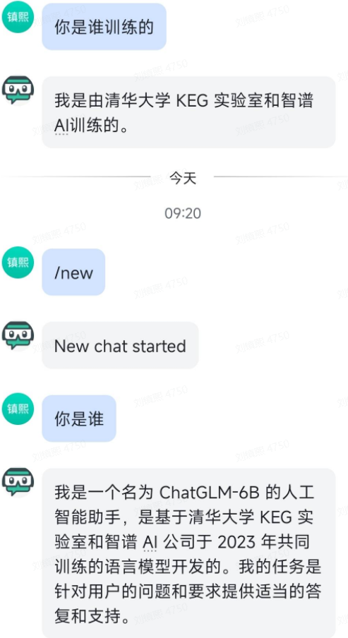

# Feishu-ChatGLM
🍎 一套使用chatGLM模型，能够调用本地知识库的python版飞书**智能**聊天机器人实现方案。  

## 实现思路  
预计使用使用python为主要开发语言，调用huggingface中的chatGLM模型并实现对话api，利用langchain框架中的 Agent 和 Indexes 模块来处理对话角色和私有数据库的逻辑。

🚀 预计需要完成的功能列表:

✨ 产品规划

- [X] python版飞书机器人实现  
- [X] ChatGLM 聊天 api 实现  
- [ ] 利用 langchain 的 agent 模块实现多角色的丝滑转换能力  
- [ ] 利用 langchain 的 indexes 模块实现两种类型的本地知识读取  
  - [ ] 一个文件夹内的多个txt文件读取和索引  
  - [ ] 一个超长文本文件的分片读取和索引  
- [ ] 两种 chatGLM与 本地知识交互类型的逻辑开发  
  - [ ] 预设部分知识嵌入的聊天机器人实现  
  - [ ] 根据用户输入内容动态处理需要嵌入的知识内容实现  


✨ 功能列表
- 单聊自动记忆上下文，不需要飞书回复机器人(更符合聊天直觉) 
- 输入 `/new` 清除历史上下文开启新会话  
- 同时支持openai, azure, chatGLM 的模型接口 
  
    
    
## 聊天截图
  
  
  
  
## 本地部署使用方法

建议环境：conda环境 python 3.10，以下命令为 linux 命令行SHELL命令，windows请根据类似情况调整

### STEP1 启动 chatGLM 的api  
1. 此步骤可以在本机，也可以在服务器等其他机器，即 `src/chatglm_sever` 这个模块可以移至其他任何地方运行
2. 安装conda环境，切换conda环境（步骤略）
3. `cd ./src/chatglm_server`
4. `pip install -r requirements.txt`  安装 python 依赖包, pytorch 的安装会要比较长的时间
5. `python chatglm_server.py` 启动 chatGLM api 服务
6. 第一次启动需要下载 chatGLM 模型，时间会比较久，默认是 'THUDM/chatglm-6b-int4' 
7. 默认支持cpu、gpu、多卡gpu进行部署，一些参数的调整见脚本`server.py`的开头部分
8. 记录好部署ip地址和端口号（如果为本机和默认配置，则为 http://localhost:8000

  
详细流程见chatGLM官方github: https://github.com/THUDM/ChatGLM-6B  
也可以使用网上别人搭建的用来试用的 chatGLM api 测试（若如此可跳过以上步骤）

### STEP2 启动飞机机器人所需服务
1. `cd ..` 回到项目根目录 
2. `mv config-example.yml config.yml` 给配置文件改名  
3. `vim config.yml` 根据yml文件中的提示修改配置  
4. `pip install -r requirements.txt`  安装 python 依赖包
5. run `python3 src/main.py`


### STEP3 创建飞书机器人，并使用测试用的公网地址  
- 前往开发者平台创建应用,并获取到 APPID 和 Secret
- 前往应用功能-机器人, 创建机器人
- 从 cpolar、serverless 或 Railway 获得公网地址，在飞书机器人后台的 事件订阅 板块填写。例如，
http://xxxx.r6.cpolar.top为 cpolar 暴露的公网地址
/webhook/event为统一的应用路由
最终的回调地址为 http://xxxx.r6.cpolar.top/webhook/event
- 在飞书机器人后台的 机器人 板块，填写消息卡片请求网址。例如，
http://xxxx.r6.cpolar.top为 cpolar 暴露的公网地址
/webhook/card为统一的应用路由
- 最终的消息卡片请求网址为 http://xxxx.r6.cpolar.top/webhook/card
- 在事件订阅板块，搜索三个词机器人进群、 接收消息、 消息已读, 把他们后面所有的权限全部勾选。 进入权限管理界面，搜索图片, 勾选获取与上传图片或文件资源。 最终会添加下列回调事件
```im:resource(获取与上传图片或文件资源)
im:message
im:message.group_at_msg(获取群组中所有消息)
im:message.group_at_msg:readonly(接收群聊中@机器人消息事件)
im:message.p2p_msg(获取用户发给机器人的单聊消息)
im:message.p2p_msg:readonly(读取用户发给机器人的单聊消息)
im:message:send_as_bot(获取用户在群组中@机器人的消息)
im:chat:readonly(获取群组信息)
im:chat(获取与更新群组信息)
```
## Docker部署方法（待更新）


## 赞助感谢

友情感谢 'Find My Ai' 提供的部分经费赞助！

